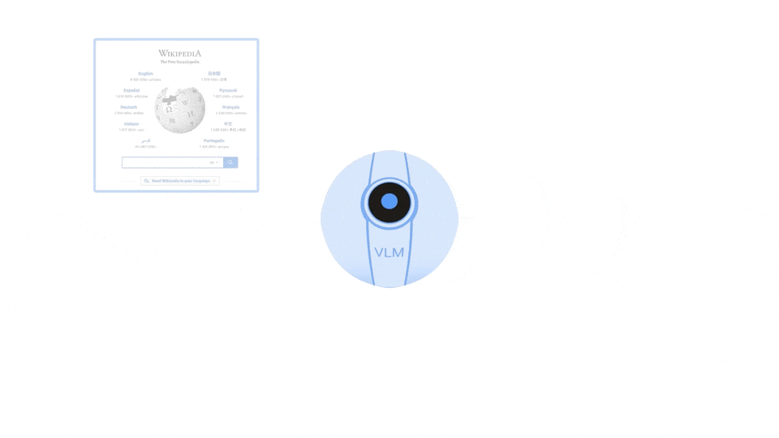

[](https://discord.gg/qUtxnK2NMf)


# Robotic Transformer 2 (RT-2): The Vision-Language-Action Model


<div align="center">

[](https://github.com/kyegomez/RT-2/issues) 
[](https://github.com/kyegomez/RT-2/network) 
[](https://github.com/kyegomez/RT-2/stargazers) 
[](https://github.com/kyegomez/RT-2/blob/master/LICENSE)
[](https://twitter.com/intent/tweet?text=Excited%20to%20introduce%20RT-2,%20the%20all-new%20robotics%20model%20with%20the%20potential%20to%20revolutionize%20automation.%20Join%20us%20on%20this%20journey%20towards%20a%20smarter%20future.%20%23RT1%20%23Robotics&url=https%3A%2F%2Fgithub.com%2Fkyegomez%2FRT-2)
[](https://www.facebook.com/sharer/sharer.php?u=https%3A%2F%2Fgithub.com%2Fkyegomez%2FRT-2)[](https://www.linkedin.com/shareArticle?mini=true&url=https%3A%2F%2Fgithub.com%2Fkyegomez%2FRT-2&title=Introducing%20RT-2%2C%20the%20All-New%20Robotics%20Model&summary=RT-2%20is%20the%20next-generation%20robotics%20model%20that%20promises%20to%20transform%20industries%20with%20its%20intelligence%20and%20efficiency.%20Join%20us%20to%20be%20a%20part%20of%20this%20revolutionary%20journey%20%23RT1%20%23Robotics&source=)

[](https://www.reddit.com/submit?url=https%3A%2F%2Fgithub.com%2Fkyegomez%2FRT-2&title=Exciting%20Times%20Ahead%20with%20RT-2%2C%20the%20All-New%20Robotics%20Model%20%23RT1%20%23Robotics)
[](https://news.ycombinator.com/submitlink?u=https%3A%2F%2Fgithub.com%2Fkyegomez%2FRT-2&t=Exciting%20Times%20Ahead%20with%20RT-2%2C%20the%20All-New%20Robotics%20Model%20%23RT1%20%23Robotics)
[](https://pinterest.com/pin/create/button/?url=https%3A%2F%2Fgithub.com%2Fkyegomez%2FRT-2&media=https%3A%2F%2Fexample.com%2Fimage.jpg&description=RT-2%2C%20the%20Revolutionary%20Robotics%20Model%20that%20will%20Change%20the%20Way%20We%20Work%20%23RT1%20%23Robotics)
[](https://api.whatsapp.com/send?text=I%20just%20discovered%20RT-2,%20the%20all-new%20robotics%20model%20that%20promises%20to%20revolutionize%20automation.%20Join%20me%20on%20this%20exciting%20journey%20towards%20a%20smarter%20future.%20%23RT1%20%23Robotics%0A%0Ahttps%3A%2F%2Fgithub.com%2Fkyegomez%2FRT-2)

</div>

---


Robotic Transformer 2 (RT-2) leverages both web and robotics data to generate actionable instructions for robotic control. 

[CLICK HERE FOR THE PAPER](https://robotics-transformer2.github.io/assets/rt2.pdf)


## Installation

RT-2 can be easily installed using pip:

```bash
pip install rt2
```

Additionally, you can manually install the dependencies:

```bash
pip install -r requirements.txt
```

# Usage


The `RT2` class is a PyTorch module that integrates the PALM-E model into the RT-2 class. Here are some examples of how to use it:

#### Initialization

First, you need to initialize the `RT2` class. You can do this by providing the necessary parameters to the constructor:

```python

import torch 
from rt2.model import RT2

rt2 = RT2()

video = torch.randn(2, 3, 6, 224, 224)
instructions = [
    "bring me an apple on that tree"
]

train_logits = rt2(video, instructions)
rt2.eval()
eval_logits = rt2(video, instructions, cond_scale=2)

```

#### Forward Pass
After initializing the RT2 class, you can perform a forward pass by calling the forward method and providing a video and optional texts:

```python

video = torch.rand((1, 3, 224, 224))
texts = ["this is a text"]
output = rt2(video, texts)

```
* The forward method returns the logits for the given video and texts.


#### Changing Parameters
You can also change the parameters of the RT2 class after initialization. For example, you can change the number of actions and action bins:

```python
rt2.num_actions = 5
rt2.action_bins = 128
```
* After changing the parameters, you can perform a forward pass as before:

```python
output = rt2(video, texts)
```

#### Saving and Loading The Model

```python
torch.save(rt2.state_dict(), 'rt3_model.pth')
```

* You can then load the model with `torch.load``

```python
from rt2.model import RT2

model = RT2()

model.load_state_dict(torch.load('rt_model.pth'))
```

#### Eval the Model
* Evaluate RT2 by setting it to eval mode and then performing a forward pass
```python

model.eval()
with torch.no_grad():
    video = torch.randn((1, 3, 10, 224))
    texts = ["this is  atest"]
    output = model(video, texts)

```


## Benefits

RT-2 stands at the intersection of vision, language, and action, delivering unmatched capabilities and significant benefits for the world of robotics.

- Leveraging web-scale datasets and firsthand robotic data, RT-2 provides exceptional performance in understanding and translating visual and semantic cues into robotic control actions.
- RT-2's architecture is based on well-established models, offering a high chance of success in diverse applications.
- With clear installation instructions and well-documented examples, you can integrate RT-2 into your systems quickly.
- RT-2 simplifies the complexities of multi-domaster understanding, reducing the burden on your data processing and action prediction pipeline.

## Model Architecture

RT-2 integrates a high-capacity Vision-Language model (VLM), initially pre-trained on web-scale data, with robotics data from RT-2. The VLM uses images as input to generate a sequence of tokens representing natural language text. To adapt this for robotic control, RT-2 outputs actions represented as tokens in the model’s output.

RT-2 is fine-tuned using both web and robotics data. The resultant model interprets robot camera images and predicts direct actions for the robot to execute. In essence, it converts visual and language patterns into action-oriented instructions, a remarkable feat in the field of robotic control.

# Datasets
[Head over to see some datasets they used in the paper](docs/DATASETS.md)


# Appreciation

* Anthony Brohan, Noah Brown, Justice Carbajal, Yevgen Chebotar, Xi Chen, Krzysztof Choromanski,
* Tianli Ding, Danny Driess, Avinava Dubey, Chelsea Finn, Pete Florence, Chuyuan Fu,
* Montse Gonzalez Arenas, Keerthana Gopalakrishnan, Kehang Han, Karol Hausman, Alexander Herzog,
* Jasmine Hsu, Brian Ichter, Alex Irpan, Nikhil Joshi, Ryan Julian, Dmitry Kalashnikov, Yuheng Kuang,
* Isabel Leal, Lisa Lee, Tsang-Wei Edward Lee, Sergey Levine, Yao Lu, Henryk Michalewski, Igor Mordatch,
* Karl Pertsch, Kanishka Rao, Krista Reymann, Michael Ryoo, Grecia Salazar, Pannag Sanketi,
* Pierre Sermanet, Jaspiar Singh, Anikait Singh, Radu Soricut, Huong Tran, Vincent Vanhoucke, Quan Vuong,
* Ayzaan Wahid, Stefan Welker, Paul Wohlhart, Jialin Wu, Fei Xia, Ted Xiao, Peng Xu, Sichun Xu, Tianhe Yu,
* and Brianna Zitkovich

for writing this amazing paper and advancing Humanity

* LucidRains for providing the base repositories for [PALM](https://github.com/lucidrains/PaLM-rlhf-pytorch) and [RT-1](https://github.com/kyegomez/RT-2)

* Any you yes the Human looking at this right now, I appreciate you and love you.

## Commercial Use Cases

The unique capabilities of RT-2 open up numerous commercial applications:

- **Automated Factories**: RT-2 can significantly enhance automation in factories by understanding and responding to complex visual and language cues.
- **Healthcare**: In robotic surgeries or patient care, RT-2 can assist in understanding and performing tasks based on both visual and verbal instructions.
- **Smart Homes**: Integration of RT-2 in smart home systems can lead to improved automation, understanding homeowner instructions in a much more nuanced manner.

## Examples and Documentation

Detailed examples and comprehensive documentation for using RT-2 can be found in the [examples](https://github.com/kyegomez/RT-2/tree/master/examples) directory and the [documentation](https://github.com/kyegomez/RT-2/tree/master/docs) directory, respectively.

## Contributing

Contributions to RT-2 are always welcome! Feel free to open an issue or pull request on the GitHub repository.

## License

RT-2 is provided under the MIT License. See the LICENSE file for details.

## Contact

For any queries or issues, kindly open a GitHub issue or get in touch with [kyegomez](https://github.com/kyegomez).

## Citation

```
@inproceedings{RT-2,2023,
  title={},
  author={Anthony Brohan, Noah Brown, Justice Carbajal, Yevgen Chebotar, Xi Chen, Krzysztof Choromanski,
Tianli Ding, Danny Driess, Avinava Dubey, Chelsea Finn, Pete Florence, Chuyuan Fu,
Montse Gonzalez Arenas, Keerthana Gopalakrishnan, Kehang Han, Karol Hausman, Alexander Herzog,
Jasmine Hsu, Brian Ichter, Alex Irpan, Nikhil Joshi, Ryan Julian, Dmitry Kalashnikov, Yuheng Kuang,
Isabel Leal, Lisa Lee, Tsang-Wei Edward Lee, Sergey Levine, Yao Lu, Henryk Michalewski, Igor Mordatch,
Karl Pertsch, Kanishka Rao, Krista Reymann, Michael Ryoo, Grecia Salazar, Pannag Sanketi,
Pierre Sermanet, Jaspiar Singh, Anikait Singh, Radu Soricut, Huong Tran, Vincent Vanhoucke, Quan Vuong,
Ayzaan Wahid, Stefan Welker, Paul Wohlhart, Jialin Wu, Fei Xia, Ted Xiao, Peng Xu, Sichun Xu, Tianhe Yu,
and Brianna Zitkovich},
  year={2024}
}
```